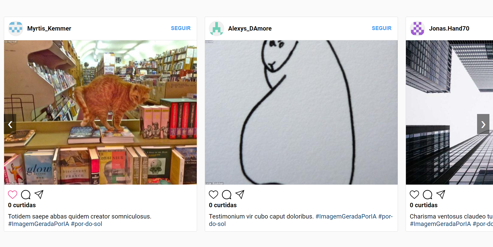

# Clone Instagram Web

Este projeto é um clone básico do Instagram, que simula a visualização de postagens, curtidas e a interação com perfis de usuários. Utiliza HTML, CSS e TypeScript para criar uma experiência semelhante à do aplicativo real.

## Imagens do Projeto

## Tecnologias Utilizadas

- **HTML**: Estruturação do conteúdo da página.
- **CSS**: Estilização e layout dos componentes. Utiliza transições e animações para melhorar a interatividade.
- **TypeScript**: Lógica do aplicativo, manipulação de eventos e geração dinâmica de postagens utilizando a biblioteca `faker` para dados fictícios.
- **UUID**: Utilizado para gerar IDs únicos para cada postagem.

## Estrutura do Projeto

### 1. **index.html**

Este é o arquivo principal que contém a estrutura HTML da página. Ele inclui:

- Links para o CSS e fontes do Google.
- Um contêiner para as postagens em formato de carrossel, que permite a rolagem horizontal.

### 2. **estilos.css**

Contém todas as regras de estilo para o projeto. Os principais estilos incluem:

- Estilização do corpo da página, garantindo que o conteúdo fique centralizado.
- Estilos para o ícone de ação (curtir), incluindo uma animação de "pop" ao ser clicado, e mudança de cor para vermelho.
- Estilização do carrossel, postagens e cabeçalhos.

### 3. **script.ts**

Contém a lógica principal do aplicativo. Os principais componentes incluem:

- **Classe Post**: Representa uma postagem com informações como nome de usuário, URL da imagem, descrição e número de curtidas. Possui métodos para curtir e gerar HTML da postagem.
- **Funções**:
  - `generatePost()`: Gera uma nova postagem usando a biblioteca `faker`.
  - `addEventListenersToLikeButtons()`: Adiciona listeners aos botões de curtir para atualizar o estado e o número de curtidas.
  - `addEventListenersToFollowButtons()`: Adiciona listeners aos botões de seguir, alternando entre os estados "SEGUIR" e "SEGUINDO".
  - `addPostsToContainer()`: Adiciona um número específico de postagens ao contêiner na página.
  - `scrollCarousel()`: Função para rolar o carrossel de postagens.

## Funcionamento

1. **Carregamento da Página**: Ao abrir o `index.html`, o script TypeScript é executado, gerando postagens aleatórias e as inserindo no contêiner.
2. **Interação com Postagens**: O usuário pode clicar no ícone de coração para curtir a postagem, o que ativará a animação de "pop" e mudará a cor do ícone para vermelho. O número de curtidas é atualizado em tempo real.
3. **Carrossel de Postagens**: O usuário pode navegar entre as postagens usando os botões de "anterior" e "próximo".

## Contribuições

Sinta-se à vontade para contribuir com melhorias ou novas funcionalidades. Você pode abrir um "pull request" ou criar uma nova "issue" para discutir novas ideias.

## Licença

Este projeto é de código aberto e pode ser utilizado livremente, desde que a autoria seja mencionada.

---

Sinta-se à vontade para personalizar e expandir este projeto conforme necessário!
